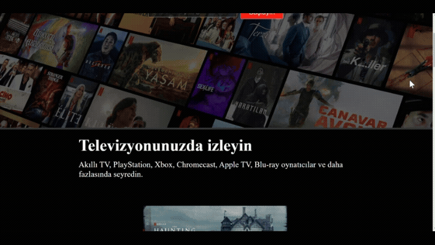

# NETFLİX CLONE PROJESİ

#Bu, HTML ve CSS kullanılarak inşa edilmiş bir Netflix klon projesidir. Bu projenin amacı, Netflix anasayfasının görsel tasarımını kopyalamaktır ve modern web geliştirme uygulamaları ile responsive tasarımı sergilemektir.

##ÖZELLİKLER

-Masaüstü ve mobil için responsive tasarım.

-Logo ve butonlarla çekici bir başlık.

-Geliştirilmiş kullanıcı arayüzü deneyimi için yerleştirilmiş videolar.

##
Kullanılan Teknolojiler

-HTML5: İçeriği yapılandırma.

-CSS3: Stil verme ve responsive tasarım.
##

EKRAN

 

